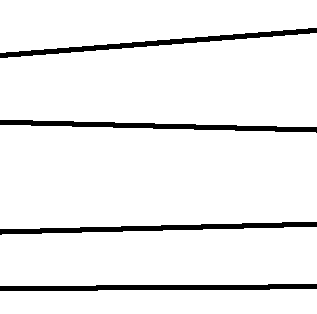
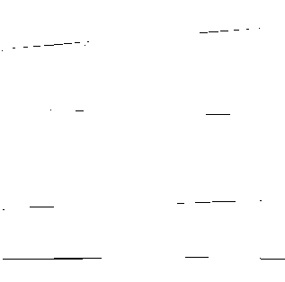
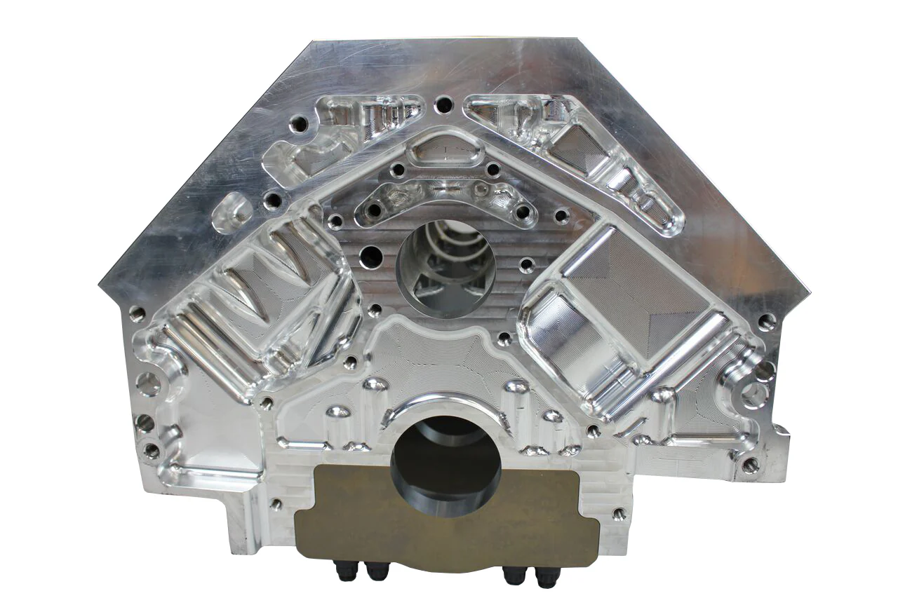
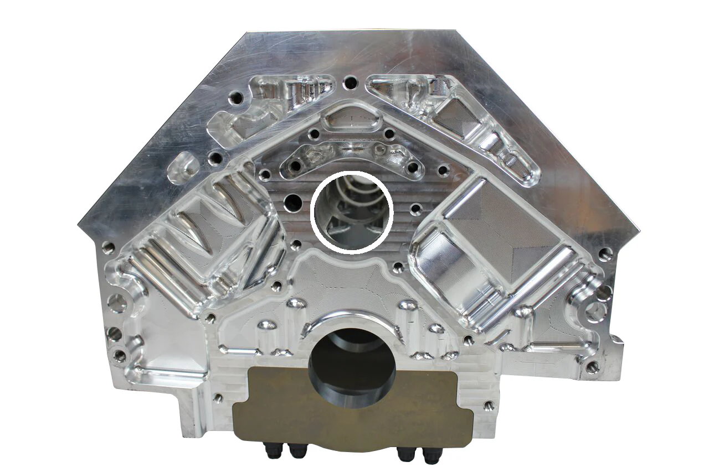
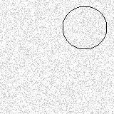
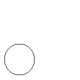

# AI Vision Algorithms

A comprehensive collection of advanced computer vision and artificial intelligence algorithms implemented in Java. This repository demonstrates practical implementations of image processing, pattern recognition, and search algorithms.

## 🚀 Projects Overview

### 1. Hough Transform Implementation
An implementation of the Hough Transform algorithm for detecting both lines and circles in images.

#### Features:
- Line detection using parametric space transformation
- Circle detection with configurable radius range
- Non-maximal suppression for optimal circle detection
- Edge detection preprocessing
- Customizable threshold parameters

#### Example Results:

##### Line Detection

    

        <h6>Before</h6>
        
    

    

        <h6>After</h6>
        
    

##### Circle Detection

    

        <h6>Before</h6>
        
    

    

        <h6>After</h6>
        
    

### 2. Hopfield Neural Network
A complete implementation of a Hopfield Neural Network for pattern recognition and memory retrieval.

#### Features:
- Pattern storage and recognition
- Asynchronous update rule
- Energy function minimization
- Convergence to stored patterns
- Noise-tolerant pattern recovery

#### Example Results:

    

        <h6>Before</h6>
        
    

    

        <h6>After</h6>
        
    

